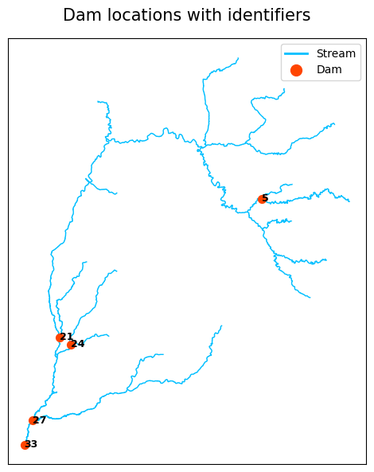
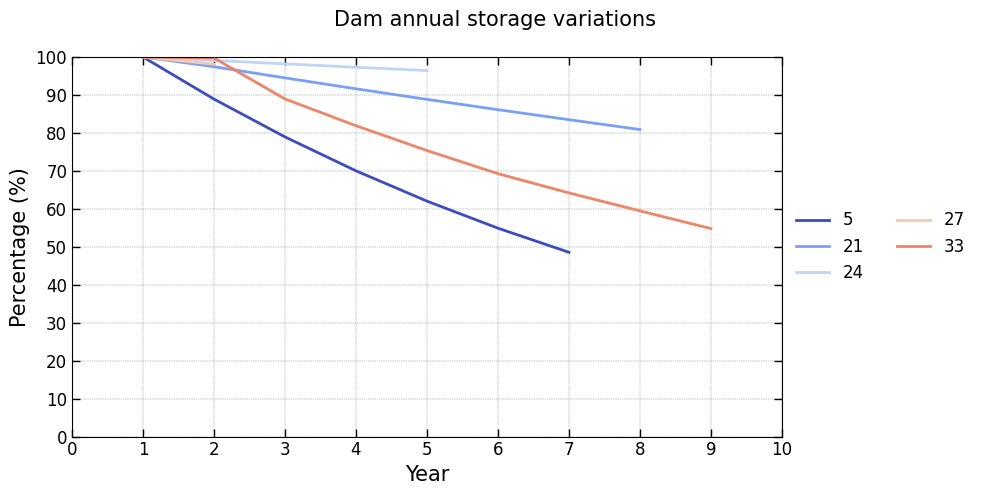
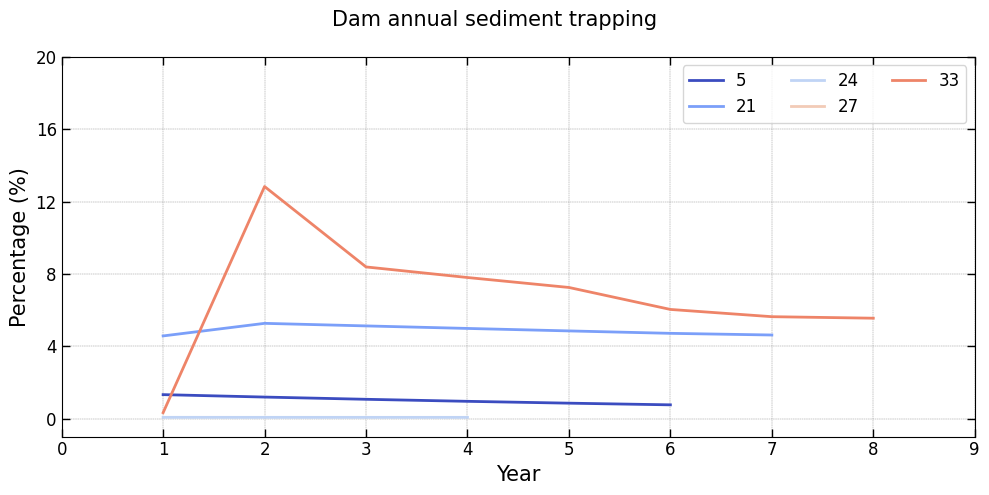
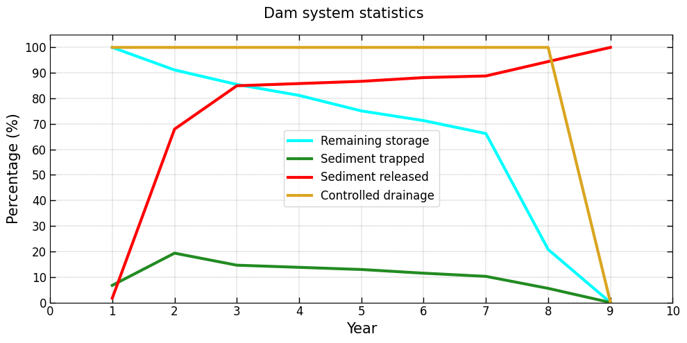

============
User Guide
============

This guide provides an overview for working with the :mod:`OptiDamTool` package.

Verify Installation
---------------------

To verify the installation, import the package and module and instantiate the classes using the following code.
If no errors are raised, the installation is successful.

.. code-block:: python

    import OptiDamTool
    watemsedem = OptiDamTool.WatemSedem()
    network = OptiDamTool.Network()
    analysis = OptiDamTool.Analysis()
    visual = OptiDamTool.Visual()

.. _ref_dem_to_stream:
    
DEM to Stream 
-------------------

To generate the input files required to run the WaTEM/SEDEM model with the  
`river routing = 1 <https://watem-sedem.github.io/watem-sedem/model_extensions.html#riverrouting>`_ extension,  
refer to the :meth:`OptiDamTool.WatemSedem.dem_to_stream` method for more details on the output.  
A sample Digital Elevation Model (DEM) raster file is available in the  
`data <https://github.com/debpal/OptiDamTool/tree/main/tests/data>`_ directory for testing purposes.

.. code-block:: python

    watemsedem.dem_to_stream(
        dem_file=r"C:\users\username\input_data\dem.tif",
        flwacc_percent=1,
        folder_path=r"C:\users\username\output_folder"
    )

Model Region Extension 
--------------------------

To ensure compatibility with WaTEM/SEDEM, which does not support NoData cells, input rasters must be extended to include a buffer area beyond the original model region.
This ensures that all computations are based on continuous data without missing values. A raster that covers the model region, typically the DEM raster,
is used to create an extended region raster that includes the desired buffer zone.

.. code-block:: python
    
    watemsedem.model_region_extension(
        dem_file=r"C:\users\username\input_folder\dem.tif",
        buffer_units=50,
        folder_path=r"C:\users\username\output_folder"
    )

Using the ``region_buffer.tif`` raster generated by the :meth:`OptiDamTool.WatemSedem.model_region_extension` method, other input rasters for WaTEM/SEDEM, such as the stream raster
produced in the :ref:`ref_dem_to_stream` section, are spatially extended.
During this process, NoData areas are replaced with a specified fill value, resulting in a continuous raster suitable for further analysis.

.. code-block:: python
    
    watemsedem.raster_extension(
        input_file=r"C:\users\username\output_folder\stream_lines.tif",
        fill_value=0,
        region_file=r"C:\users\username\output_folder\region_buffer.tif",
        output_file=r"C:\users\username\output_folder\stream_buffer.tif"
    )

A constant raster, such as the `erosion control factor <https://watem-sedem.github.io/watem-sedem/watem-sedem.html#p-factor>`_,  
is required for small regions when running WaTEM/SEDEM.  
Using the ``region.tif`` and ``region_buffer.tif`` rasters generated by the :meth:`OptiDamTool.WatemSedem.model_region_extension` method,  
a constant-value raster can be created efficiently, as shown below:

.. code-block:: python
    
    watemsedem.raster_constant_extension(
        input_file=r"C:\users\username\output_folder\region.tif",
        constant_value=1,
        region_file=r"C:\users\username\output_folder\region_buffer.tif",
        output_file=r"C:\users\username\output_folder\RUSEL_P_buffer.tif",
        fill_value=0,
        dtype='float32'
    )
    
    
Raster Spatial Analysis
-------------------------------

For focused spatial analysis, extracting a specific region from a large raster is often necessary.
This function clips a raster using a rectangular bounding box derived from the total bounds
of an input shapefile. If required, the shapefile’s Coordinate Reference System (CRS) is automatically transformed
to match the CRS of the raster.

.. code-block:: python
    
    watemsedem.raster_clipping_by_bounding_box(
        input_file=r"C:\users\username\input_folder\land_cover_ESRI.tif",
        shape_file=r"C:\users\username\output_folder\region_buffer.tif",
        output_file=r"C:\users\username\output_folder\land_cover_region.tif",
        dtype='int16'
    )

After clipping, the output raster must be reprojected, clipped again, and rescaled in resolution
to align with the model region. The input shapefile's CRS and spatial extent are used
for reprojection and spatial clipping. A mask raster, which shares the same extent as the shapefile,
is used to rescale the resolution of the reprojected and clipped raster.

.. code-block:: python
    
    watemsedem.raster_reproject_clipping_rescaling(
        input_file=r"C:\users\username\output_folder\land_cover_region.tif",
        resampling_method='nearest',
        shape_file=r"C:\users\username\output_folder\region.shp",
        mask_file=r"C:\users\username\output_folder\region.tif",
        output_file=r"C:\users\username\output_folder\land_cover_unprocessed.tif"
    )
    
    
Land Cover Processing
-------------------------------

To create land cover and management factor rasters required by WaTEM/SEDEM,
use the following codes and refer to methods :meth:`OptiDamTool.WatemSedem.land_cover_esri`
and :meth:`OptiDamTool.WatemSedem.land_management_factor` for more details.

.. code-block:: python
    
    # land cover raster 
    watemsedem.land_cover_esri(
        lc_file=r"C:\users\username\output_folder\land_cover_unprocessed.tif",
        stream_file=r"C:\users\username\output_folder\stream_lines.shp",
        folder_path=r"C:\users\username\output_folder"
    )
    
    # land management factor
    watemsedem.land_cover_esri(
        lc_file=r"C:\users\username\output_folder\land_cover_unprocessed.tif",
        stream_file=r"C:\users\username\output_folder\stream_lines.shp",
        output_file=r"C:\users\username\output_folder\RUSLE_C.tif"
    )
    
    
Product of Soil Erodibility and Rainfall Erosivity Factors
--------------------------------------------------------------------

WaTEM/SEDEM uses the product of the Soil Erodibility (K) and Rainfall Erosivity (R) factors
when these values vary spatially across a large area. The multiplication is normalized by setting
the value of R to 1 where necessary. Refer to the method :meth:`OptiDamTool.WatemSedem.rusle_kr` for more details.

.. code-block:: python
    
    watemsedem.rusle_kr(
        k_file=r"C:\users\username\input_data\RUSLE_K.tif",
        r_file=r"C:\users\username\input_data\RUSLE_R.tif",
        region_file=r"C:\users\username\output_folder\region.tif",
        output_file=r"C:\users\username\output_folder\RUSLE_KR.tif",
        k_multiplier=1000
    )
    
    
Raster Driver Conversion
-----------------------------

WaTEM/SEDEM does not support raster files in the ``GTiff`` format. Therefore, input rasters must be converted to the Idrisi raster format with the .rst extension,
which is one of the `two raster formats <https://watem-sedem.github.io/watem-sedem/rasterinfo.html#format>`_ supported by WaTEM/SEDEM.

.. code-block:: python
    
    watemsedem.raster_driver_to_rst(
        file_dict={'rusle_p': r"C:\users\username\output_folder\RUSEL_P_buffer.tif"},
        folder_path=r"C:\users\username\output_folder"
    )

    
Adjacent Connectivity Between Dams
-----------------------------------------

To determine the adjacent upstream and downstream connectivity between dams based on a stream network, a stream shapefile is required.  
This shapefile must contain a column representing a unique identifier for each stream segment.

Only one dam can be deployed per stream segment, and the dam is identified by the corresponding stream segment’s unique identifier.  
The specified stream segment identifiers are used to designate dam deployment locations.

A sample stream shapefile is available in the  
`data <https://github.com/debpal/OptiDamTool/tree/main/tests/data>`_ directory.  
The examples below generate dictionaries representing the adjacent upstream and downstream connectivity of dams based on the stream network.  
A value of -1 indicates no downstream connectivity, while an empty list indicates no upstream connectivity.

.. code-block:: python
    
    # adjacent downstream connectivity
    network.connectivity_adjacent_downstream_dam(
        stream_file=r"C:\users\username\input_folder\stream_lines.shp",
        dam_list=[21, 22, 5, 31, 17, 24, 27, 2, 13, 1]
    )
    
    # adjacent upstream connectivity
    network.connectivity_adjacent_upstream_dam(
        stream_file=r"C:\users\username\input_folder\stream_lines.shp",
        dam_list=[21, 22, 5, 31, 17, 24, 27, 2, 13, 1]
    )
    
    
Controlled Drainage Area of Dams
-----------------------------------------

When working with a dam system within a stream network, the controlled upstream drainage areas  
for each dam are dynamically influenced by their specific locations.  
The following method calculate these areas.

.. code-block:: python
    
    network.controlled_drainage_area(
        stream_file=r"C:\users\username\input_folder\stream_lines.shp",
        dam_list=[21, 22, 5, 31, 17, 24, 27, 2, 13, 1]
    )
    
    
Integration of Stream Information and Sediment Inflow Files
----------------------------------------------------------------

To support informed decision-making when deploying a dam system within a stream network, it is essential to have detailed information for each stream segment.
This includes attributes such as stream connectivity, subbasin area, and sediment inflow. The following methods demonstrate how to generate a JSON file
containing comprehensive stream segment data with sediment delivery values, and a GeoJSON shapefile that spatially represents sediment inflow for each segment.
Sediment inflow into stream segments is computed using WaTEM/SEDEM with the extension
`Output per river segment = 1 <https://watem-sedem.github.io/watem-sedem/model_extensions.html#output-per-river-segment>`_ enabled.
For more details, refer to the method documentation.

.. code-block:: python
    
    # integrate sediment inflow to stream information TXT file
    analysis.sediment_delivery_to_stream_json(
        info_file=r"C:\users\username\input_folder\stream_information.json",
        segsed_file=r"C:\users\username\input_folder\Total sediment segments.txt",
        cumsed_file=r"C:\users\username\input_folder\Cumulative sediment segments.txt",
        json_file=r"C:\users\username\output_folder\stream_with_sediment.json"
    )    
    
    # stream shapefile with sediment inflow information 
    analysis.sediment_delivery_to_stream_geojson(
        stream_file=r"C:\users\username\input_folder\stream_lines.shp",
        sediment_file=rr"C:\users\username\output_folder\stream_with_sediment.json",
        geojson_file=r"C:\users\username\output_folder\stream_with_sediment.geojson"
    )

Once the final stream GeoJSON file containing sediment inflow information is generated, it can be used to compute a summary of upstream metrics for selected dams.
This includes identifying each dam’s directly connected upstream dams, calculating its controlled drainage area, and estimating the corresponding sediment inflow from that area.
These metrics provide a comprehensive understanding of how the upstream network structure influences hydrological and sediment contributions to individual dam locations.

.. code-block:: python

    network.upstream_metrics_summary(
        stream_file=r"C:\users\username\output_folder\stream_with_sediment.geojson",
        dam_list=[21, 22, 5, 31, 17, 24, 27, 2, 13, 1]
    )

.. _ref_dam_system_storgae_dynamics:

Dam System Storage Dynamics for Sedimentation
---------------------------------------------------

This method simulates the annual storage dynamics of a dam system affected by sedimentation. For each simulation year,
the total sediment inflow to a dam is calculated based on two components: the sediment generated from the dam’s own drainage area
and the sediment released from upstream dams.

The trapped sediment is determined by multiplying the total sediment inflow by the dam’s trap efficiency,
which is a value between 0 and 1. At the end of each simulation year, the storage capacity of each dam is updated using a mass balance approach
that accounts for the volume of sediment trapped.

When a dam becomes inactive, either because it has no remaining storage capacity or
its sediment trapping efficiency falls below a defined threshold, the simulation dynamically updates the system.
This includes adjusting system connectivity, recalculating controlled drainage areas, and updating sediment inflows to other dams in the network.

The simulation continues for a user-defined number of years or terminates early if all dams become inactive. The function returns a dictionary
where each key corresponds to a DataFrame containing dam lifespan results, system-wide sedimentation statistics,
individual dam performance metrics, and the simulation parameters used.

This method also provides an option to save the output dictionary to the input directory as a set of JSON files.
Each file is named after a dictionary key and contains the corresponding DataFrame.

.. code-block:: python
    
    network.storage_dynamics_detailed(
        stream_file=r"C:\users\username\output_folder\stream_with_sediment.geojson",
        storage_dict={
            21: 1500000,
            5: 100000,
            24: 60000,
            27: 200000,
            33: 1000000,
        },
        sediment_density=1300,
        trap_threshold=0.05,
        year_limit=100,
        write_output=True,
        folder_path=r"C:\users\username\output_folder"
    )

    
A lite version of this method is also available, providing a simplified simulation with limited output. For complete details, refer to the method
:meth:`OptiDamTool.Network.storage_dynamics_lite`.

To generate GeoJSON files of updated dam location points and their controlled drainage polygons when dams become inactive:

.. code-block:: python
    
    network.storage_dynamics_and_drainage_scenarios(
        stream_file=r"C:\users\username\output_folder\stream_with_sediment.geojson",
        flwdir_file=r"C:\users\username\output_folder\flwdir.tif",
        storage_dict={
            21: 1500000,
            5: 100000,
            24: 60000,
            27: 100000,
            33: 1000000,
        },
        year_limit=15,
        sediment_density=1300,
        trap_threshold=0.05,
        folder_path=r"C:\users\username\output_folder"
    )

   
Visualization of Dam System Simulation
------------------------------------------------------

This section presents visualizations of the simulated results generated in the :ref:`ref_dam_system_storgae_dynamics` section.

To create a figure showing dam locations along the stream path, use the following code:

.. code-block:: python

    visual.dam_location_in_stream(
        stream_file=r"C:\users\username\output_folder\stream_with_sediment.geojson",
        dam_file=r"C:\Users\username\output_folder\year_0_dam_location_point.geojson",
        figure_file=r"C:\users\username\output_folder\dam_location_in_stream.png"
    )
    
    
To generate a figure showing the annual remaining storage of each dam in the system at the beginning of the year, use the following code:

.. code-block:: python

    visual.dam_remaining_storage(
        json_file=r"C:\users\username\output_folder\dam_remaining_storage.json",
        figure_file=r"C:\users\username\output_folder\dam_remaining_storage.png",
        xtick_gap=1
    )
    
To generate a figure showing the annual sediment trapping percentage by each dam in the system,
relative to the total sediment input across all stream segments during the year, use the following code:

.. code-block:: python

    visual.dam_trapped_sediment(
        json_file=r"C:\users\username\output_folder\dam_trapped_sediment.json",
        figure_file=r"C:\users\username\output_folder\dam_trapped_sediment.png",
        xtick_gap=1,
        ytick_gap=4,
        ybottom_offset=-1
    )

To generate a figure showing dam system-level statistics, including controlled drainage area, remaining storage, sediment trapped, and sediment released, use the following code:

.. code-block:: python

    visual.system_statistics(
        json_file=r"C:\users\username\output_folder\system_statistics.json",
        figure_file=r"C:\users\username\output_folder\system_statistics.png",
        ytop_offset=5,
        xtick_gap=1
    )

The following figures are the outputs produced by the above code.

    

    

